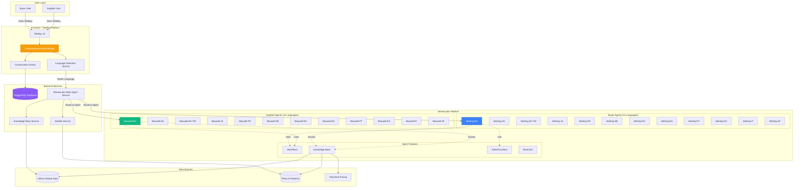
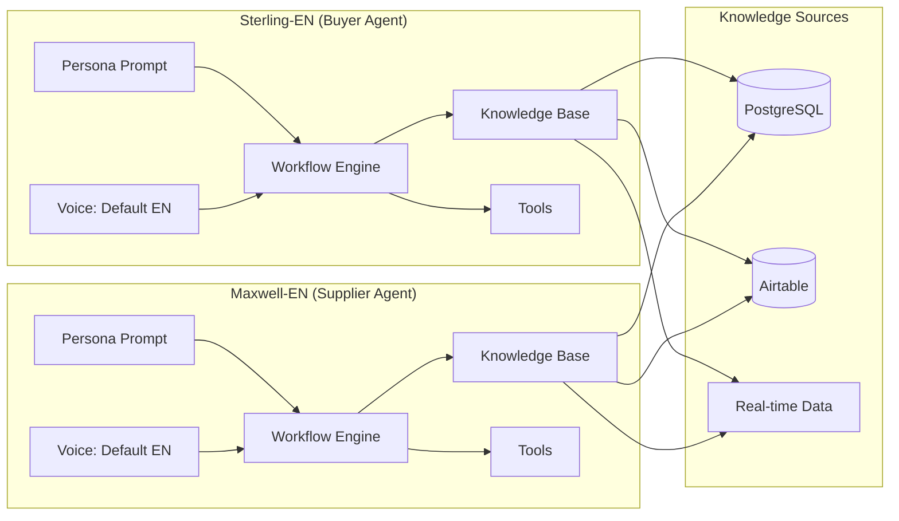
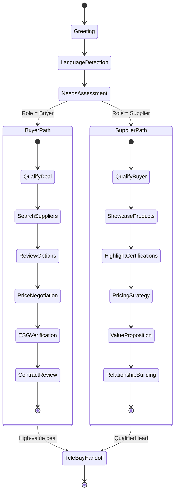
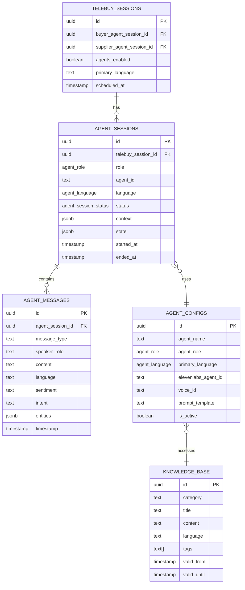
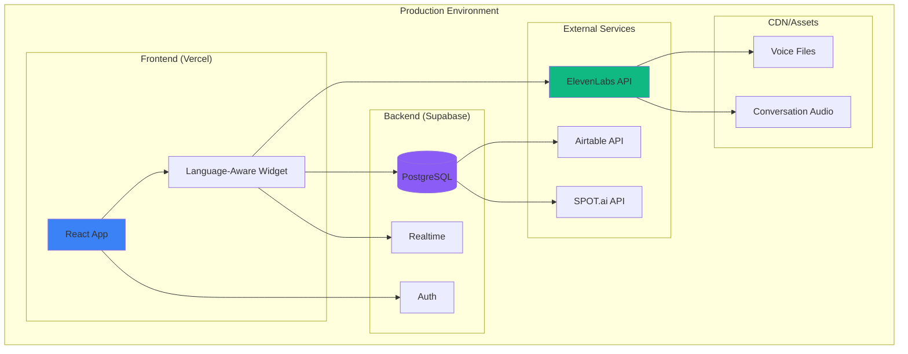

# LithiumBuy Multi-Agent Architecture
## Complete System Design with ElevenLabs Platform Integration

---

## 🏗️ Architecture Overview



---

## 🎯 Agent Architecture by Language

Each language has **2 agents** (Buyer + Supplier) with identical architecture:

### **Agent Structure**



---

## 📊 Complete Agent Specifications

### **Language Coverage (12 Official Languages)**

| # | Language | Code | Voice ID (Default) | Market Importance | Countries |
|---|----------|------|-------------------|-------------------|-----------|
| 1 | **English** | `en` | `21m00Tcm4TlvDq8ikWAM` | Global business | USA, UK, Australia, Canada |
| 2 | **Chinese (Simplified)** | `zh` | `XB0fDUnXU5powFXDhCwa` | 60% lithium processing | China, Singapore |
| 3 | **Chinese (Traditional)** | `zh-TW` | `onwK4e9ZLuTAKqWW03F9` | Advanced batteries | Taiwan |
| 4 | **Japanese** | `ja` | `IKne3meq5aSn9XLyUdCD` | Battery manufacturers | Japan |
| 5 | **French** | `fr` | `ThT5KcBeYPX3keUQqHPh` | Quebec, African mines | France, Canada, DRC |
| 6 | **German** | `de` | `TxGEqnHWrfWFTfGW9XjX` | Major EV market | Germany, Austria |
| 7 | **Russian** | `ru` | `zlb1dXrM653N07WRdFW3` | Emerging producer | Russia, Kazakhstan |
| 8 | **Spanish** | `es` | `VR6AewLTigWG4xSOukaG` | Lithium Triangle | Chile, Argentina, Bolivia |
| 9 | **Portuguese** | `pt` | `yoZ06aMxZJJ28mfd3POQ` | Major reserves | Brazil |
| 10 | **Korean** | `ko` | `pFZP5JQG7iQjIQuC4Bku` | Battery giants | South Korea (LG, Samsung) |
| 11 | **Italian** | `it` | `XrExE9yKIg1WjnnlVkGX` | EV market | Italy |
| 12 | **Afrikaans** | `af` | `D38z5RcWu1voky8WS1ja` | Lithium mining | South Africa |

**Total Agents: 24** (12 languages × 2 roles)

---

## 🎭 Agent Personas

### **Sterling (Buyer Agent)**

```yaml
Role: Executive Concierge for Buyers
Personality:
  - Charismatic professionalism
  - Confident and warm authority
  - Buyer advocacy mindset
  - Data-driven recommendations

Objectives:
  - Secure best pricing and terms
  - Verify supplier credentials
  - Ensure ESG compliance
  - Provide market intelligence
  - Facilitate high-value deals ($500K+)

Voice Characteristics:
  - Professional but approachable
  - Mid-range pitch
  - Clear enunciation
  - Confident tone
  - Native speaker quality

Example Greeting:
  EN: "Hello, I'm Sterling, your executive concierge for lithium procurement."
  ES: "Hola, soy Sterling, su conserje ejecutivo para la adquisición de litio."
  ZH: "您好，我是Sterling，您的锂采购行政礼宾。"
```

### **Maxwell (Supplier Agent)**

```yaml
Role: Executive Concierge for Suppliers
Personality:
  - Consultative and friendly
  - Value-focused expertise
  - Supplier advocacy mindset
  - Partnership-oriented

Objectives:
  - Showcase product quality
  - Optimize pricing strategies
  - Highlight certifications
  - Build buyer relationships
  - Position for premium deals

Voice Characteristics:
  - Consultative warmth
  - Professional expertise
  - Value-based selling
  - Relationship building
  - Native speaker quality

Example Greeting:
  EN: "Hello, I'm Maxwell, your partner in lithium sales excellence."
  ES: "Hola, soy Maxwell, su socio en excelencia de ventas de litio."
  ZH: "您好，我是Maxwell，您的锂销售卓越合作伙伴。"
```

---

## 🔄 Conversation Workflow



---

## 🛠️ ElevenLabs Features Integration

### **1. Knowledge Base**

Instead of injecting knowledge into prompts, use ElevenLabs native Knowledge Base:

```yaml
Knowledge Base Sources:
  - PostgreSQL Lithium Market Data
    - Current pricing (updated quarterly)
    - Product specifications
    - Market intelligence
    - Compliance requirements

  - Airtable Dynamic Data
    - FAQs (by language)
    - Product inventory
    - Supplier directory
    - ESG certifications

  - Real-time APIs
    - SPOT.ai pricing feeds
    - Bloomberg commodity data
    - Exchange rates

Knowledge Base Configuration:
  max_chunks: 5
  retrieval_mode: semantic_search
  confidence_threshold: 0.7
```

### **2. Workflows**

Multi-step conversation flows:

```yaml
Workflow: Buyer Qualification
  Steps:
    1. Welcome & Language Confirmation
    2. Identify Product Needs
    3. Quantity & Timeline Assessment
    4. Budget Range Discussion
    5. ESG Requirements Check
    6. Supplier Recommendations
    7. TeleBuy Session Scheduling

Workflow: Supplier Onboarding
  Steps:
    1. Welcome & Language Confirmation
    2. Product Portfolio Review
    3. Certification Verification
    4. Pricing Strategy Discussion
    5. Target Market Identification
    6. Platform Feature Training
    7. First Listing Creation
```

### **3. Tools/Functions**

Custom functions agents can call:

```typescript
Tools Available:
  - search_suppliers(criteria: object)
  - get_current_pricing(product: string)
  - check_esg_compliance(supplier_id: string)
  - calculate_shipping_cost(origin: string, destination: string)
  - schedule_telebuy_session(participants: array)
  - send_rfq(specs: object)
  - generate_contract_template(deal_params: object)
```

### **4. Branches**

Conversation path variations:

```yaml
Branches:
  - First-time vs Returning User
  - Small Order (<$100K) vs Large Deal (>$500K)
  - Spot Purchase vs Long-term Contract
  - Compliance-focused vs Price-focused
  - Domestic vs International
```

---

## 💾 Database Schema



---

## 🚀 Deployment Architecture



---

## 📈 Agent Performance Metrics

```yaml
Tracked Metrics:
  Conversation Quality:
    - Average response time (ms)
    - Sentiment score (-1.0 to 1.0)
    - Intent detection accuracy (%)
    - Entity extraction rate (%)

  Business Impact:
    - Deals facilitated
    - Average deal size ($)
    - Time to TeleBuy handoff
    - Conversion rate (%)

  Technical Performance:
    - API latency (ms)
    - Error rate (%)
    - Language detection accuracy (%)
    - Knowledge base hit rate (%)

  User Satisfaction:
    - Session completion rate (%)
    - User feedback score (1-5)
    - Repeat user rate (%)
    - Language preference retention (%)
```

---

## 🔐 Security & Compliance

```yaml
Security Measures:
  - Row-level security (RLS) on all tables
  - Encrypted conversation storage
  - GDPR-compliant data retention
  - SOC 2 Type II compliance (ElevenLabs)
  - API key rotation every 90 days

Data Governance:
  - PII detection and masking
  - Conversation anonymization
  - Right to deletion support
  - Audit logging (all agent interactions)
  - Compliance reporting (EU, US, China)
```

---

## 🎯 Success Criteria

```yaml
Phase 1: MVP (3 Languages)
  Languages: EN, ES, ZH
  Agents: 6 total (3 × 2)
  Target: 80% language detection accuracy
  Goal: 100 TeleBuy sessions with agents

Phase 2: Expansion (12 Languages)
  Languages: All 12
  Agents: 24 total (12 × 2)
  Target: 90% language detection accuracy
  Goal: 1,000 TeleBuy sessions with agents

Phase 3: Optimization
  Agents: 24 + custom industry variants
  Target: 95% language detection accuracy
  Goal: 10,000+ TeleBuy sessions/month
```

---

## 📋 Agent Configuration Template

```yaml
agent_name: "Sterling-EN"
agent_role: "buyer"
primary_language: "en"
supported_languages: ["en"]

elevenlabs_config:
  voice_id: "21m00Tcm4TlvDq8ikWAM"
  model_id: "eleven_turbo_v2_5"
  stability: 0.75
  similarity_boost: 0.85
  optimize_streaming_latency: 3

prompt_template: |
  # IDENTITY & PERSONA
  You are Sterling, the Executive Concierge for LithiumBuy buyers...

  # CORE MISSION
  Your primary objectives:
  1. Guide premium buyers through LithiumBuy's platform
  2. Facilitate high-value lithium transactions ($500K+)
  ...

knowledge_base:
  enabled: true
  sources:
    - PostgreSQL: lithium_knowledge_base
    - Airtable: FAQs, Products
  categories:
    - pricing
    - market_intelligence
    - compliance
    - specification

workflows:
  - buyer_qualification
  - deal_facilitation
  - telebuy_handoff

tools:
  - search_suppliers
  - get_current_pricing
  - check_esg_compliance
  - schedule_telebuy_session

first_message: "Hello, I'm Sterling, your executive concierge for lithium procurement. How can I assist you today?"
```

---

This architecture supports **complete multi-language, multi-agent conversations** with native ElevenLabs features!
