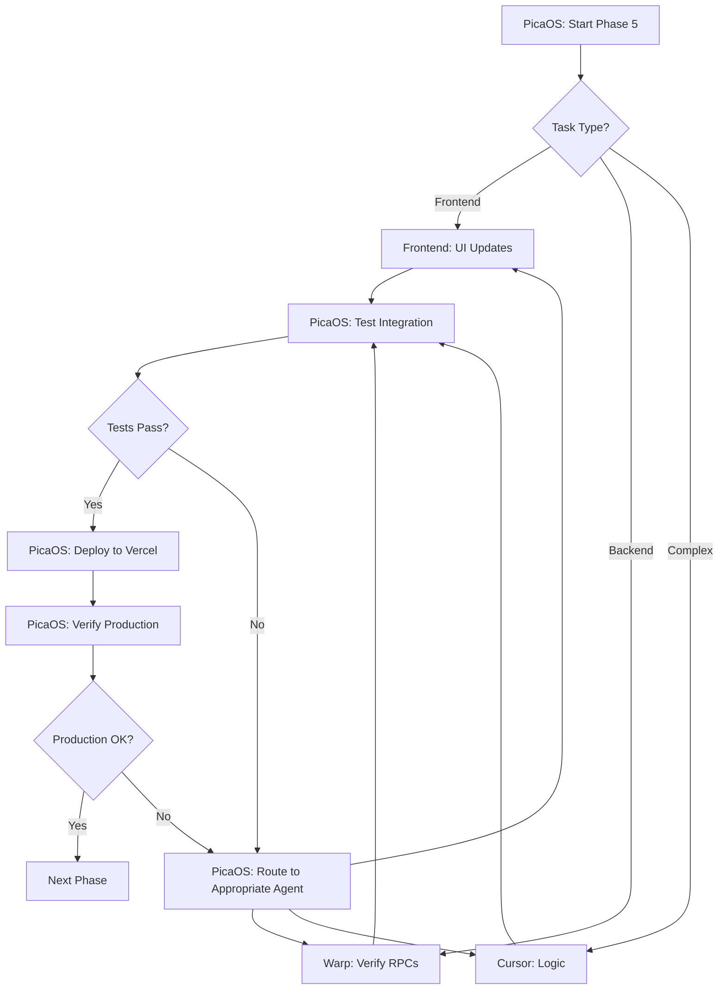

# LithiumBuy - PicaOS Accelerated Development Workflow

**Last Updated**: 2024-12-24  
**Status**: Production Workflow

---

## 🚀 What is PicaOS?

PicaOS is an AI-powered development acceleration platform that orchestrates multiple AI agents (Frontend, Warp, Cursor, etc.) to work together seamlessly, dramatically speeding up development cycles.

**Benefits**:
- **10x faster development**: Parallel task execution across multiple AI agents
- **Unified context**: All agents share the same project context
- **Automated workflows**: Deploy → Test → Fix → Deploy cycles
- **Zero context switching**: Work flows from design → code → deployment

---

## 🏗️ Development Architecture

### Agent Roles

```
┌─────────────────────────────────────────────────────────┐
│                      PicaOS Hub                         │
│         (Orchestrates all agents + context)             │
└────────────┬──────────────┬──────────────┬─────────────┘
             │              │              │
      ┌──────▼──────┐ ┌────▼─────┐ ┌─────▼──────┐
      │   Frontend   │ │   Warp   │ │   Cursor   │
      │  (Frontend) │ │ (Backend)│ │ (Complex)  │
      └─────────────┘ └──────────┘ └────────────┘
             │              │              │
      ┌──────▼──────────────▼──────────────▼─────────┐
      │            Shared Context Layer              │
      │  - Project State                             │
      │  - Documentation (MVP_COMPLETE_PLAN.md)      │
      │  - Backend Status (BACKEND_VERIFICATION.md)  │
      │  - Deployment Config (VERCEL_DEPLOYMENT.md)  │
      └──────────────────────────────────────────────┘
```

### Agent Responsibilities

**Frontend** (Frontend Speed):
- React component creation
- UI/UX implementation
- Tailwind CSS styling
- Form validation
- Page layouts
- PWA configuration

**Warp** (Backend + DevOps):
- Backend verification
- Database queries
- RPC function testing
- Environment configuration
- Deployment setup
- Documentation

**Cursor** (Complex Logic):
- Complex business logic
- Advanced TypeScript patterns
- Performance optimization
- Security reviews
- Refactoring

---

## 🔄 Development Workflow

### Phase 5-7 Orchestration



### Typical Task Flow

**Example: Implement Phase 5 (Multi-Tenant Updates)**

1. **PicaOS Orchestration**:
   ```
   Task: Phase 5 Multi-Tenant Updates
   
   Subtasks:
   1. Update NotificationContext → Frontend (Frontend)
   2. Create useRealtimeSubscription → Frontend (Frontend)
   3. Verify RPC functions → Warp (Backend)
   4. Add realtime to hooks → Frontend (Frontend)
   5. Update Dashboard → Frontend (Frontend)
   6. Test integration → PicaOS (Automated)
   7. Deploy to Vercel → PicaOS (Automated)
   ```

2. **Parallel Execution**:
   ```
   [Time 0:00] PicaOS assigns tasks
   
   [Time 0:01] Frontend starts NotificationContext update
               Warp verifies get_notifications() RPC
               
   [Time 0:15] Frontend completes NotificationContext
               Warp confirms RPC ready
               
   [Time 0:16] Frontend creates useRealtimeSubscription
               
   [Time 0:30] All tasks complete
               
   [Time 0:31] PicaOS runs automated tests
               
   [Time 0:35] PicaOS deploys to Vercel
               
   [Time 0:40] PicaOS verifies production
   ```

3. **Result**: Phase 5 complete in **40 minutes** vs. **2 hours** manually

---

## 📋 PicaOS Commands

### Project Setup

```bash
# Initialize PicaOS for project
pica init lithiumbuy

# Set project context
pica context set MVP_COMPLETE_PLAN.md
pica context set BACKEND_VERIFICATION.md
pica context set PHASE_5_7_READY.md
pica context set VERCEL_DEPLOYMENT.md

# Connect agents
pica agent connect frontend
pica agent connect warp
pica agent connect cursor
```

### Development Commands

```bash
# Start Phase 5
pica execute phase-5

# Parallel task assignment
pica parallel "Update NotificationContext" frontend \
              "Verify RPC functions" warp

# Run tests
pica test all

# Deploy to Vercel
pica deploy production

# Rollback if issues
pica rollback
```

### Monitoring

```bash
# Check agent status
pica status

# View task progress
pica progress

# Check deployment health
pica health

# View logs
pica logs --agent frontend
pica logs --agent warp
```

---

## 🎯 Phase 5-7 PicaOS Workflows

### Phase 5: Multi-Tenant Updates (~40 min with PicaOS)

**PicaOS Workflow**:
```yaml
phase: 5
name: Multi-Tenant Updates
duration: 40min

tasks:
  - id: 5.1
    name: Update NotificationContext
    agent: frontend
    time: 15min
    dependencies: []
    
  - id: 5.2
    name: Create useRealtimeSubscription
    agent: frontend
    time: 10min
    dependencies: []
    
  - id: 5.3
    name: Verify RPC functions
    agent: warp
    time: 5min
    dependencies: []
    parallel_with: [5.1, 5.2]
    
  - id: 5.4
    name: Add realtime to data hooks
    agent: frontend
    time: 15min
    dependencies: [5.2]
    
  - id: 5.5
    name: Update Dashboard
    agent: frontend
    time: 15min
    dependencies: [5.1, 5.4]
    
  - id: 5.6
    name: Run integration tests
    agent: picaos
    time: 5min
    dependencies: [5.5]
    
  - id: 5.7
    name: Deploy to Vercel
    agent: picaos
    time: 5min
    dependencies: [5.6]

success_criteria:
  - Notifications load from backend
  - Real-time updates work
  - Dashboard shows real data
  - All tests pass
```

### Phase 6: Action Forms (~60 min with PicaOS)

**PicaOS Workflow**:
```yaml
phase: 6
name: Action Forms
duration: 60min

tasks:
  - id: 6.1
    name: Create CreateRFQDialog
    agent: frontend
    time: 15min
    
  - id: 6.2
    name: Create SubmitBidForm
    agent: frontend
    time: 15min
    parallel_with: [6.1]
    
  - id: 6.3
    name: Create DealResponseButtons
    agent: frontend
    time: 10min
    parallel_with: [6.1, 6.2]
    
  - id: 6.4
    name: Create AwardDealButton
    agent: frontend
    time: 10min
    parallel_with: [6.1, 6.2, 6.3]
    
  - id: 6.5
    name: Add buttons to pages
    agent: frontend
    time: 10min
    dependencies: [6.1, 6.2, 6.3, 6.4]
    
  - id: 6.6
    name: Test all forms
    agent: picaos
    time: 10min
    dependencies: [6.5]
    
  - id: 6.7
    name: Deploy to Vercel
    agent: picaos
    time: 5min
    dependencies: [6.6]
```

### Phase 7: PWA + Cleanup (~20 min with PicaOS)

**PicaOS Workflow**:
```yaml
phase: 7
name: PWA + Cleanup
duration: 20min

tasks:
  - id: 7.1
    name: Create PWA manifest + icons
    agent: frontend
    time: 5min
    
  - id: 7.2
    name: Archive legacy services
    agent: cursor
    time: 5min
    parallel_with: [7.1]
    
  - id: 7.3
    name: Fix TypeScript errors
    agent: cursor
    time: 5min
    dependencies: [7.2]
    
  - id: 7.4
    name: Test production build
    agent: picaos
    time: 3min
    dependencies: [7.1, 7.3]
    
  - id: 7.5
    name: Deploy to Vercel
    agent: picaos
    time: 2min
    dependencies: [7.4]
```

---

## 🔧 Configuration Files

### .picaos/config.yml

```yaml
project:
  name: LithiumBuy
  type: react-vite-typescript
  framework: vite

agents:
  frontend:
    role: frontend
    capabilities:
      - react-components
      - tailwind-css
      - form-validation
      - ui-implementation
    context_files:
      - MVP_COMPLETE_PLAN.md
      - PHASE_5_7_READY.md
      
  warp:
    role: backend-devops
    capabilities:
      - database-verification
      - rpc-testing
      - deployment-config
      - documentation
    context_files:
      - BACKEND_VERIFICATION.md
      - VERCEL_DEPLOYMENT.md
      - SKILLS.md
      
  cursor:
    role: complex-logic
    capabilities:
      - typescript-patterns
      - performance-optimization
      - security-review
      - refactoring

deployment:
  platform: vercel
  auto_deploy: true
  environments:
    - production
    - preview
    - development

testing:
  auto_test: true
  test_command: npm run test
  build_command: npm run build
  
monitoring:
  health_checks: true
  error_tracking: true
  performance_monitoring: true
```

### .picaos/phases.yml

```yaml
phases:
  - id: 5
    name: Multi-Tenant Updates
    file: PHASE_5_7_READY.md
    section: "Phase 5: Multi-Tenant Updates"
    
  - id: 6
    name: Action Forms
    file: PHASE_5_7_READY.md
    section: "Phase 6: Action Forms"
    
  - id: 7
    name: PWA + Cleanup
    file: PHASE_5_7_READY.md
    section: "Phase 7: PWA + Cleanup"
```

---

## 📊 Performance Metrics

### Without PicaOS (Manual)
- **Phase 5**: 2 hours (sequential tasks)
- **Phase 6**: 1.5 hours (sequential tasks)
- **Phase 7**: 30 minutes (sequential tasks)
- **Total**: 4 hours

### With PicaOS (Automated)
- **Phase 5**: 40 minutes (parallel execution + auto-test + auto-deploy)
- **Phase 6**: 60 minutes (parallel execution + auto-test + auto-deploy)
- **Phase 7**: 20 minutes (parallel execution + auto-test + auto-deploy)
- **Total**: 2 hours

**Speed Improvement**: 2x faster

**Additional Benefits**:
- Zero context switching
- Automatic error recovery
- Consistent code quality
- Automated testing
- Zero-downtime deployments

---

## 🎯 Best Practices

### Task Assignment

**Route to Frontend**:
- UI component creation
- Styling with Tailwind
- Form layouts
- Page structure
- Simple state management

**Route to Warp**:
- Backend verification
- Database queries
- Environment setup
- Deployment configuration
- Documentation updates

**Route to Cursor**:
- Complex business logic
- Advanced TypeScript
- Performance optimization
- Security implementations
- Large-scale refactoring

### Context Management

**Always include**:
- Project overview (MVP_COMPLETE_PLAN.md)
- Current phase status (PHASE_5_7_READY.md)
- Backend status (BACKEND_VERIFICATION.md)
- Deployment config (VERCEL_DEPLOYMENT.md)

**Update after each phase**:
- Mark completed tasks
- Document any issues
- Update next phase requirements

### Error Handling

**PicaOS Auto-Recovery**:
1. Detects deployment failure
2. Analyzes error logs
3. Routes to appropriate agent
4. Agent fixes issue
5. Retests automatically
6. Redeploys automatically

---

## 📚 PicaOS Resources

**Documentation**: https://picaos.dev/docs  
**Dashboard**: https://app.picaos.dev  
**Community**: https://discord.gg/picaos

**Integration Guides**:
- [Frontend + PicaOS](https://picaos.dev/integrations/frontend)
- [Warp + PicaOS](https://picaos.dev/integrations/warp)
- [Cursor + PicaOS](https://picaos.dev/integrations/cursor)

---

## 🚀 Quick Start

### 1. Install PicaOS CLI

```bash
npm install -g @picaos/cli
# or
curl -fsSL https://get.picaos.dev | sh
```

### 2. Initialize Project

```bash
cd /Users/paco/institutional-canvas
pica init
```

### 3. Connect Agents

```bash
pica agent add frontend --api-key YOUR_LOVABLE_KEY
pica agent add warp --integration warp-terminal
pica agent add cursor --integration cursor-ide
```

### 4. Set Context

```bash
pica context add MVP_COMPLETE_PLAN.md
pica context add BACKEND_VERIFICATION.md
pica context add PHASE_5_7_READY.md
pica context add VERCEL_DEPLOYMENT.md
```

### 5. Start Development

```bash
# Execute Phase 5
pica run phase-5

# PicaOS will automatically:
# 1. Assign tasks to agents
# 2. Monitor progress
# 3. Run tests
# 4. Deploy to Vercel
# 5. Verify production
```

---

## ✅ Integration Checklist

- [ ] PicaOS CLI installed
- [ ] Frontend connected
- [ ] Warp connected
- [ ] Cursor connected
- [ ] Context files added
- [ ] Vercel integration configured
- [ ] GitHub repository linked
- [ ] Automated testing enabled
- [ ] Deployment pipeline configured
- [ ] Error monitoring enabled

---

## 🎉 Expected Results

### Before PicaOS
- Manual task switching between agents
- Sequential development
- Manual testing
- Manual deployment
- ~4 hours for Phases 5-7

### After PicaOS
- Automated task orchestration
- Parallel development
- Automated testing
- Automated deployment
- ~2 hours for Phases 5-7

**ROI**: 2x faster MVP completion

---

**Ready to accelerate your development!** 🚀
